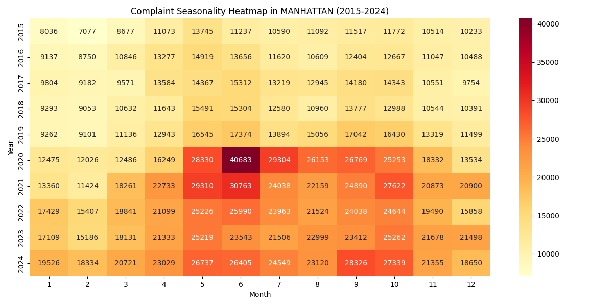
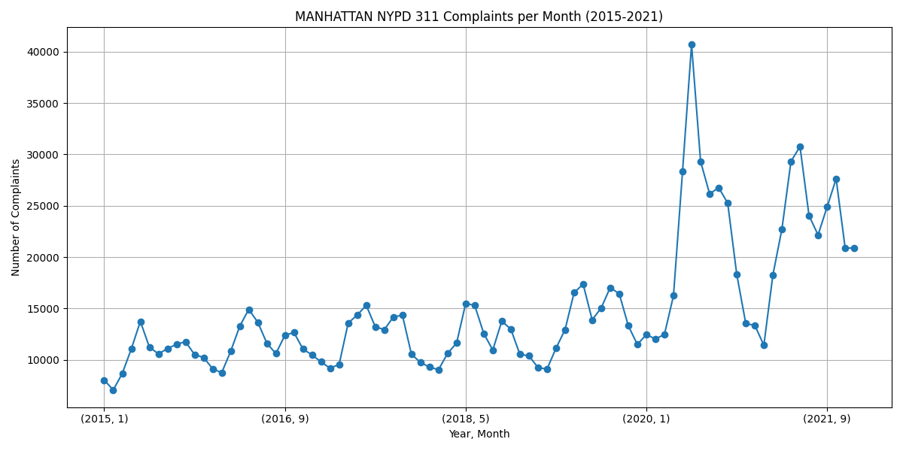

# NYC 311 Complaints Analysis (Phase 2)

Author: Edward Hinson  
Project: NYC-311 Data Project – Phase 2  

This project builds on Phase 1 by creating an interactive data exploration tool for NYC 311 service requests. Users can select a borough, start year, and end year (2015–2024), and the program will:
- Pull complaint records from [NYC Open Data API](https://data.cityofnewyork.us/)
- Clean and structure the dataset for analysis
- Generate a report in the form of multiple visualizations and a CSV file in a time stamped folder

The focus remains on NYPD-related complaints, but Phase 2 expands flexibility and adds more analysis features.

---
## New in Phase 2
- User input: Pick a borough (Bronx, Brooklyn, Manhattan, Queens, or Staten Island) and a year range.
- Error handling: Built in retry/quit handling for API failures.
- Visualizations: The program now produces a series of visualizations (Matplotlib, Seaborn) based on the borough and year range that reflect trends in the data
- Report folder: All visualizations and the complete CSV are stored in a time stamped, labeled directory

---

## 📊 Project Goals
- Learn how to pull and filter data from a public API (Socrata).  
- Clean and prepare the NYC 311 dataset for analysis.  
- Explore complaint patterns by type, time of year, and reporting channel.  
- Save a cleaned dataset for reuse in later project phases.
- Explore new visualization styles with Matplotlib and Seaborn
- Produce report folder for borough and year range

---

## 📂 Data Source
- **Dataset**: [311 Service Requests from 2010 to Present](https://data.cityofnewyork.us/Social-Services/311-Service-Requests-from-2010-to-Present/erm2-nwe9)  
- **Dataset ID**: `erm2-nwe9`  
- **API**: Socrata Open Data API (SODA)  

---

## Example Output Images

**Manhattan Heatmap**  


**Manhattan Monthly Complaints**  


---

## ⚙️ Requirements
This project uses Python and the following libraries:
- `pandas`  
- `sodapy` 
- `seaborn`
- `matplotlib`

## Instructions

1. **Clone the repository** (or download the code):  
   ```bash
   git clone https://github.com/hinsoned/nyc-311-explorer
   cd nyc-311-explorer
   ```

2. **Set up a virtual environment** (recommended):  
   ```bash
   python3 -m venv venv
   source venv/bin/activate   # macOS/Linux
   venv\Scripts\activate      # Windows
   ```

3. **Install dependencies**:  
   ```bash
   pip install -r requirements.txt
   ```

4. **Run the program**:  
   ```bash
   python3 app.py
   ```

5. **Provide inputs when prompted**:  
   - Enter a **start year** (2015–2024)  
   - Enter an **end year** (2015–2024, must be >= start year)  
   - Enter a **borough** (`Bronx`, `Brooklyn`, `Manhattan`, `Queens`, `Staten Island`)  

6. **Wait while data is fetched** from the NYC Open Data API. Depending on the range of years selected, this may take a few minutes.

## Notes
I anticipate adding more phases to this project in the future including a hosted web app that would allow real time manipulation of parameters such as date range and borough, the elimination of the lengthy API call phase,and the addition of predictions about future 311 complains using regressions or ML.